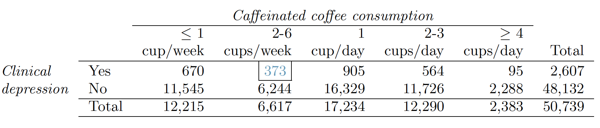

```{r setup, include=FALSE}
knitr::opts_chunk$set(echo = TRUE)
```

#Inference for categorical data

###6.6 2010 Healthcare Law. 
On June 28, 2012 the U.S. Supreme Court upheld the much debated 2010 healthcare law, declaring it constitutional. A Gallup poll released the day after this decision indicates that 46% of 1,012 Americans agree with this decision. At a 95% confidence level, this sample has a 3% margin of error. Based on this information, determine if the following statements are true or false, and explain your reasoning.

(a) We are 95% confident that between 43% and 49% of Americans in this sample support the decision of the U.S. Supreme Court on the 2010 healthcare law.   

False. We are certain that 46% of Americans in this sample support the decision, we know this for a fact since we have the sample, 100% certain. But for the entire population, we are 95% confident that between 43% and 49% of all Americans support the decision. 

(b) We are 95% confident that between 43% and 49% of Americans support the decision of the U.S. Supreme Court on the 2010 healthcare law.    
 
True. We know that for the entire population the support is between 43% and 49% with a 95% confidence level, this is inferred from the sample.
 
(c) If we considered many random samples of 1,012 Americans, and we calculated the sample proportions of those who support the decision of the U.S. Supreme Court, 95% of those sample proportions will be between 43% and 49%.    

True. 43% to 49% is the confidence interval for a 95% confidence as calculated from the original sample. So we would expect 95% of new samples to be within this interval.

(d) The margin of error at a 90% confidence level would be higher than 3%.

False. Should be lower since we are lowering our confidence. Instead of having a z* or 1.96, for a 90% confidence z*=1.65. As calculated below, margin of error would be 2.6%

```{r}
n<-1012
z<--qnorm(0.05)#90% confidence
z
p<-0.46

SE<-sqrt(p*(1-p)/n)
SE

ME<-z*SE
ME
```

###6.12 Legalization of marijuana, Part I.   
The 2010 General Social Survey asked 1,259 US residents: “Do you think the use of marijuana should be made legal, or not?” 48% of the respondents said it should be made legal.   

(a) Is 48% a sample statistic or a population parameter? Explain.   

This is sample statistic, it is a parameter of the sample, not the population. 48% corresponds to respondents in our sample only of 1259 US residents, not the entire population.

(b) Construct a 95% confidence interval for the proportion of US residents who think marijuana should be made legal, and interpret it in the context of the data.    

The analysis below shows the confidence interval is between 45.24% and 50.76%. This means we are 95% confident all US residents would respond that the use of marijuana should be made legal, same response as our sample. 

```{r}
n<-1259
p<-0.48
z<--qnorm(0.025) #95% confident
z
SE<-sqrt(p*(1-p)/n)
SE
ME<-z*SE
ME
upper<-p+ME
lower<-p-ME
round(c(lower,upper),4)
```


(c) A critic points out that this 95% confidence interval is only accurate if the statistic follows a normal distribution, or if the normal model is a good approximation. Is this true for these data? Explain.   
 
Conditions for the sampling distribution $\hat{p}$  being nearly normal need to be met:    
  1) samples should be independent, since our sample size n is much less than the total US residents, less than 10%, we can conclude they are.     
  2) we should have at least 10 successes, n*p, and 10 failures, n*(1-p), in our sample. We test this below and find that this is the case.   
Since both conditions are met, we conclude that normality is true for this sample.
  
```{r}
n*p
n*(1-p)
```
  
 
(d) A news piece on this survey’s findings states, “Majority of Americans think marijuana should be legalized.” Based on your confidence interval, is this news piece’s statement justified?   

Our confidence interval does not really support this claim. Since the interval goes below 50%, we can not claim that the majority think marijuana should be legalized. In fact, if we use our sample and calculate how much of the are under the distribution is above 50%, we can see we are only 7% confident US residents approve legalizing marijuana. We can not state majority or not think marijuana should be legalized. To keep in mind, question d states Americans, the sample is of US residents, not all US residents are Americans, so we might not be looking at the same population.

```{r}
1-pnorm(0.5,0.48,SE)
```


##6.20 Legalize Marijuana, Part II.     
As discussed in Exercise 6.12, the 2010 General Social Survey reported a sample where about 48% of US residents thought marijuana should be made legal. If we wanted to limit the margin of error of a 95% confidence interval to 2%, about how many Americans would we need to survey ?

We use formulas for ME and SE to calculate n:

ME = z* SE  => SE = ME / z*

SE = $\sqrt{p(1-p)/n}$  => n = p(1-p) / SE$^2$

Doing so we conclude we need 2398 respondents

```{r}
z<--qnorm(.025)
z
ME<-0.02
SE<-ME/z
SE
p<-0.48
n<-p*(1-p)/SE^2
ceiling(n)
```

##6.28 Sleep deprivation, CA vs. OR, Part I.     
According to a report on sleep deprivation by the Centers for Disease Control and Prevention, the proportion of California residents who reported insufficient rest or sleep during each of the preceding 30 days is 8.0%, while this proportion is 8.8% for Oregon residents. These data are based on simple random samples of 11,545 California and 4,691 Oregon residents. Calculate a 95% confidence interval for the difference between the proportions of Californians and Oregonians who are sleep deprived and interpret it in context of the data.    

For proportion deiferences we know SE${_{\hat{p1}-\hat{p2}}}$ = $\sqrt{p_{1}(1-p_{1})/n_{1} + p_{2}(1-p_{2})/n_{2}}$

Calculations below show that we are 95% condident the difference between people in California and Oregon being sleep deprived is between -1.75% and 0.15%

```{r}
p1<-0.08
p2<-0.088
p<-p1-p2
p
n1<-11545
n2<-4691
SE<-sqrt(p1*(1-p1)/n1+p2*(1-p2)/n2)
SE
z<--qnorm(0.025) #95% confidence
z
upper<-p+z*SE
lower<-p-z*SE
round(c(lower,upper),4)
```

##6.44 Barking deer. 
Microhabitat factors associated with forage and bed sites of barking deer in Hainan Island, China were examined from 2001 to 2002. In this region woods make up 4.8% of the land, cultivated grass plot makes up 14.7% and deciduous forests makes up 39.6%. Of the 426 sites where the deer forage, 4 were categorized as woods, 16 as cultivated grassplot, and 61 as deciduous forests. The table below summarizes these data.   

| Woods | Cultivated grassplot | Deciduous forests | Other | Total |
|----------------|-----------------------------------------------------------------------|---------------------------------------------------------|-------------------------------------|-------------------------------------|
| 4 | 16 | 67 | 345 | 426 |

(a) Write the hypotheses for testing if barking deer prefer to forage
in certain habitats over others.    

Ho: Barking deer do not favor a specific habitat, and the observed differences in counts reflect natural sampling fluctuation  
Ha: Barking deer do have preferences to certain habitats  

(b) What type of test can we use to answer this research question?   

We can use the Chi-square test using the table above and the expected null values from the proportion of each habitat given in the case paragraph.

(c) Check if the assumptions and conditions required for this test
are satisfied.    

If deers in one habitat don't influence deers favoring deer in other habitats then we can assume the samples are independent and that they samples are random.   
The sample size and distribution condition can be tested by calculating the expected number of deer for each habitat. As can be seen below it is greater than 5 for each habitat, thus satisfying this condition also.

```{r}
pwoods<-0.048
pcult<-0.147
pforest<-0.396
pother<-1-pwoods-pcult-pforest
df<-data.frame("Woods"=c(4,0.048),"Cultivated_grassplot"=c(16,0.147),"Deciduous_forests"=c(67,0.396),"Other"=c(345,1-0.048-0.147-0.396),"Total"=c(426,1))
#we calculate the expected values from each group
df<-rbind(df,c(df$Total[1]*df$Woods[2],df$Total[1]*df$Cultivated_grassplot[2],df$Total[1]*df$Deciduous_forests[2],df$Total[1]*df$Other[2],df$Total[1]))
df
```


(d) Do these data provide convincing evidence that barking deer prefer
to forage in certain habitats over others? Conduct an appropriate
hypothesis test to answer this research question.  

We calculate a p-value for our hypothesis against the null. From the calculation below we can see we compute a very large chi, which results in a very small, practically zero p-value. Because this is smaller than 0.05, we reject the null and find that there is evidence to suggest deer do favor one habitat over another.

```{r}
#we calculate the Z values for each group
obs<-c(df$Woods[1],df$Cultivated_grassplot[1],df$Deciduous_forests[1],df$Other[1])
expt<-c(df$Woods[3],df$Cultivated_grassplot[3],df$Deciduous_forests[3],df$Other[3])
z<-(obs-expt)/sqrt(expt)
z
chi<-sum(z^2)
chi
df<-length(obs)-1
p<-1-pchisq(chi,df=df)
p
```

##6.48 Coffee and Depression. 
Researchers conducted a study investigating the relationship between caffeinated coffee consumption and risk of depression in women. They collected data on 50,739 women free of depression symptoms at the start of the study in the year 1996, and these women were followed through 2006. The researchers used questionnaires to collect data on caffeinated coffee consumption, asked each individual about physician-diagnosed depression, and also asked about the use of antidepressants. The table below shows the distribution of incidences of depression by amount of caffeinated coffee comsumption.



(a) What type of test is appropriate for evaluating if there is an association between coffee intake and depression?

The chi-square test for two-way tables.

(b) Write the hypotheses for the test you identified in part (a).

Ho: There is no relationship between depression and coffee consumption, that is the proportion of depressed women is the same no matter what their coffee consumption is.   
Ha: There is a relationship between coffee consumption and depression in women, that is the proportion of women depressed is different for different levels of coffee consumption.      

(c) Calculate the overall proportion of women who do and do not suffer from depression.

```{r}
p_depressedTotal<-2607/50739
p_depressedTotal
p_notDepressedTotal<-48132/50739
p_notDepressedTotal
```


(d) Identify the expected count for the highlighted cell, and calculate the contribution of this cell
to the test statistic, i.e. (Observed − Expected)2/Expected.

```{r}
#expected for this group
expt2to6cupsWeek<-p_depressedTotal*6617
expt2to6cupsWeek

#test statistic for this group
testStat<-(373-expt2to6cupsWeek)^2/expt2to6cupsWeek
testStat
```


(e) The test statistic is $\chi^{2}$ = 20.93. What is the p-value?

```{r}
rows<-2
cols<-5
df<-(rows-1)*(cols-1)
df
pval<-1-pchisq(20.93,df=df)
pval
```

(f) What is the conclusion of the hypothesis test?

The calculated p-value is smaller than 0.05, so we reject the null and conclude that coffee does in fact affect depression, de proportion of depressed women in each group of different coffee comsumptions is in fact different.

(g) One of the authors of this study was quoted on the NYTimes as saying it was “too early to
recommend that women load up on extra coffe” based on just this study. Do you agree with
this statement? Explain your reasoning.

I would agree. The results do show there is a difference between the groups, but that doesn't mean drinking coffee is necessarily the best way to go about depression. There is according to the results a relationship between drinking coffee and depression, but we can't conclude with this analysis only that drinking more coffee will ameliorate depression.


